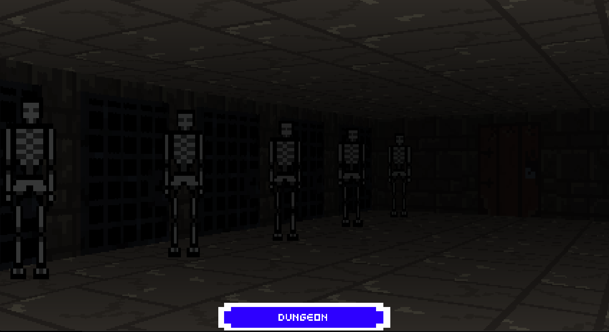
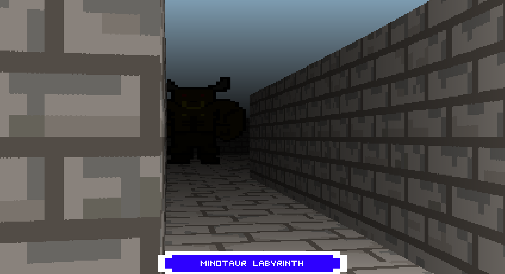
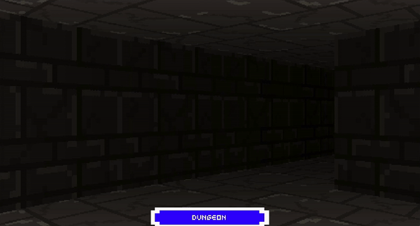
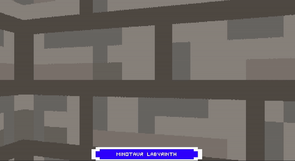

# Raycaster Engine
Old school game engine that is based on the Wolfenstein Raycasting tehnique to generate pseudo 3D environment. The game engine comes with it's own:
- Sprite editor
- Map editor

The engine is fully developed in C++ without the use of other external libraries.

# Photos

# Gifs

